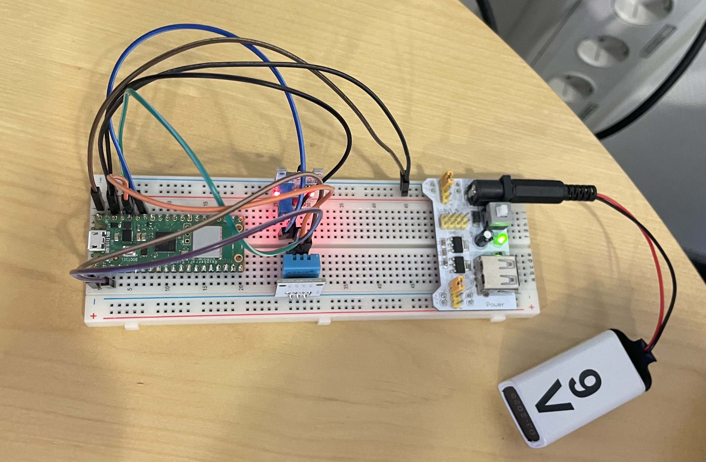

#  Termostatuller

Termostatuller is a product made for the municipality of Växjö. They wanted something to be able to read the real time value of temperature, noise levels and co2 levels in their different locals. The termostatuller offers real-time values for temperature and humidity, a 24 hour chart and a 7 day chart presented on a website. Termostatuller uses a raspberry pi with a DHT11 temperature and humidity sensor and an KY-028 temperature sensor connected. It is driven by a 9 volt battery using a breadboard power supply and a breadboard given it the battery time of approximately a quarter. Additionally it stores its values for the last 7 days on a database which can be used to follow the temperature fluctuations in different rooms. Overall, the termostatuller offers a great way to follow the temperature and humidity in different locals without having to leave the comfort of your office.

---

## Background

The idea behind the project was provided by the municipality of Växjö. They wanted to be able to see the real-time temperature, sound volume and co2 levels in their locals. One of the sensors for calculating the temperature also came with a humidity sensor giving us the ability to add humidity to our values. Given the long deliverance time for the sensors for sound volume and co2 value  we decided to only do the values for temperature and humidity to start with. If we wanted to add these sensors in later stages, the things we would have to do is write the micropython code and add more graphs to our website which would not take an excessive amount of time. 

Given the municipality's many premises over a large amount of area we wanted them to be able to follow their temperature without having to visit all of them. This is also why we went with the requirement of a quarter as the battery time. We did not want the municipality to have to visit all premises too often just to change battery. We also wanted to give them the ability to follow the fluctuations in values. We decided to showcase the last 7 days, last 24 hours and real time values on a website. This leads to us needing to save the values for the last 7 days somewhere. The values was decided to be stored in a database which the website would fetch the values from.

---

## Method
[Requirements](doc/requirements.md)

[Hardware](doc/hardware.md)

[Software setup](doc/setup.md)

[Testing](doc/test.md)

[Timelog](doc/timelog.md)

---

## Results
Overall the result of the project was a success. The product did what it was supposed to do with uploading and collecting values. The [website](https://termostatuller.billenius.com/#7d) (Username: demo, Password: demo) presented the values in graphs that was easy to read, and it presented the real-time values. The back-end worked even though it was a bit more complicated than previously predicted. 

### Results of our requirements
If we check our requirement list we can see that the product should measure temperature and humidity, values should be presented with 5 minutes between, the product should be stand-alone and it should be run on a 9 volt battery. These requirements are all completed. We also had the requirements of a website written in react, a database in mySQL, a raspberry pi pico w should be used and wifi should be used to send values. These requirements were also met when concluding the project. We also had the requirement of a quarter of a year in lifetime for the battery but that was a total failure. Our estimation after testing is that the battery only holds for about 18 hours. We had a requirement of it being lightly prepared for the expansions of sound volume and carbon dioxide content sensor which we did in the sense that nothing is restricted to only 2 values for example. To import these sensors it is basically the hardware programming that will be time consuming.

### Problems and changes
When starting to work on the project we faced some issues when trying to send our values from the pico to the database and later up to the website. We hade to set up a separate web server to be the middle man between hardware to database and database to website. This was a very time consuming thing that really haltered our project from moving forward. When finally getting that to work we began testing the sensors encountering some problems working with the KY-028 sensor with the values not being encoded properly. This took some time to fix but we eventually found a function that worked. When testing we encountered yet another problem which was the battery life, we hade the product setup for about 18 hours and then the battery was dead. After som discussions we tried to rewrite the code to c++ to get the product into a deeper sleep and hopefully make the battery life longer. As we could not find a c++ compiler that worked we had to revamp back to the micropython code. Our conclusion is that using a 9 volts battery and the raspberry pi pico will not be enough to make the battery life long enough to meet our requirements.

### What we would do different
What we would do different if we were remaking this again would be to be more prepared to buy all sensors early. We should have also used a pycom unit and lora instead of a raspberry pi and wifi to make our product save battery as this was our biggest problem. We put a lot of time into the backend which we definitely could have solved in an easier way using other components to begin with. 

--- 

Log-in screen

Hardware

## Video presentation (AD)
This is the same as _video.mp4_, but on youtube.
https://youtu.be/RT0K9PP30D4

