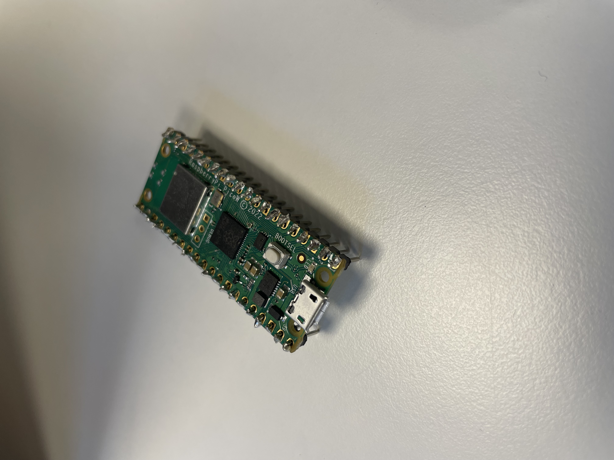
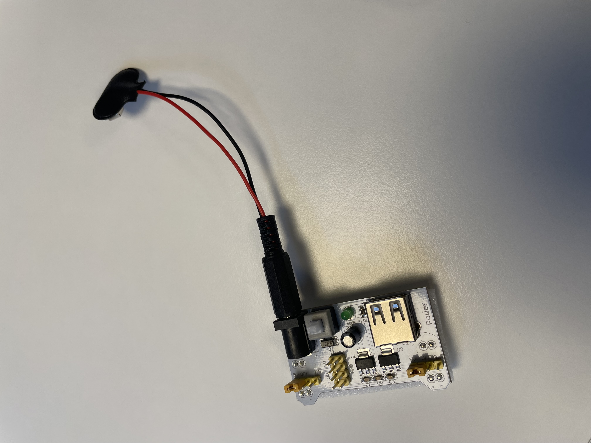
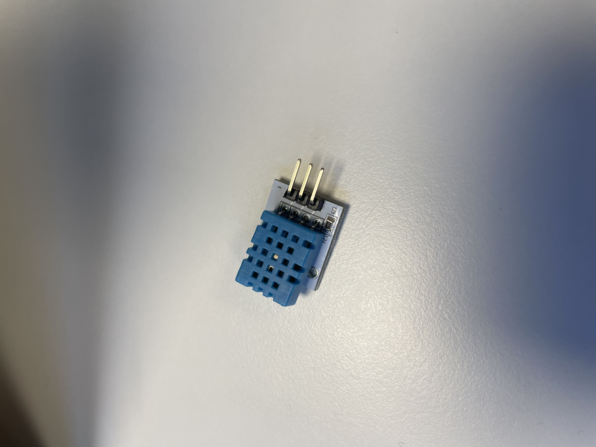
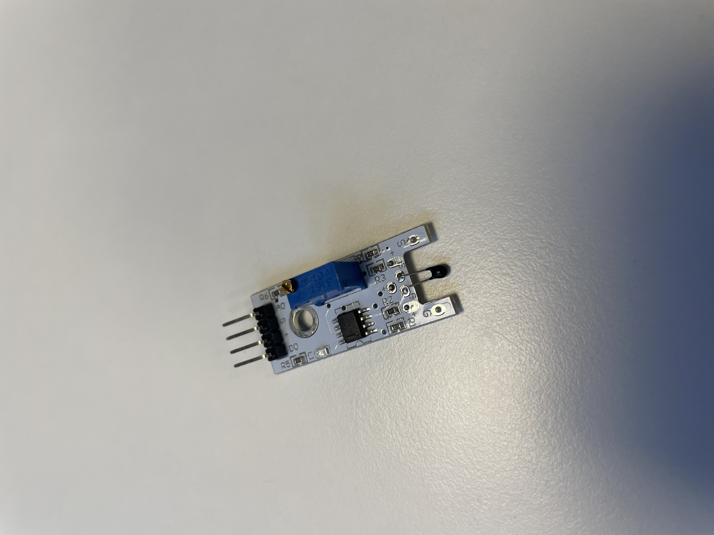
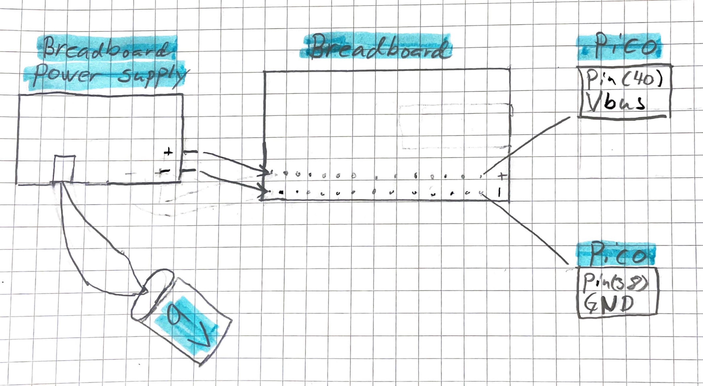
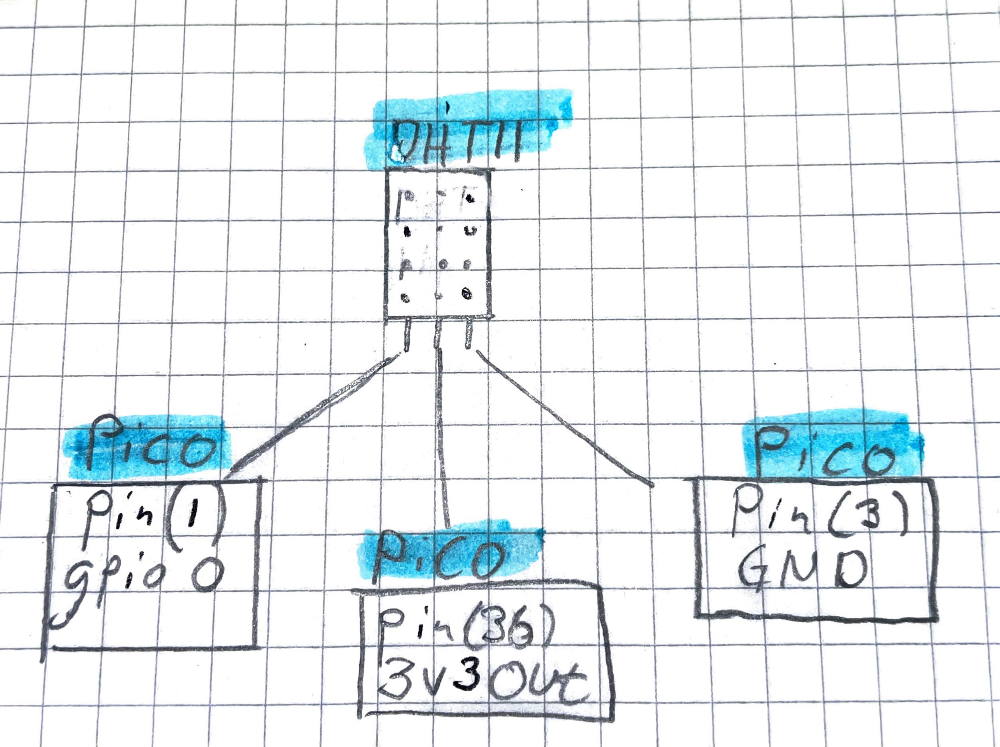
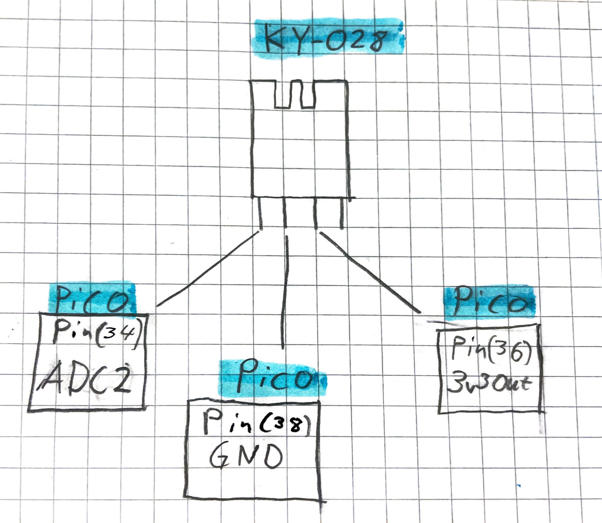
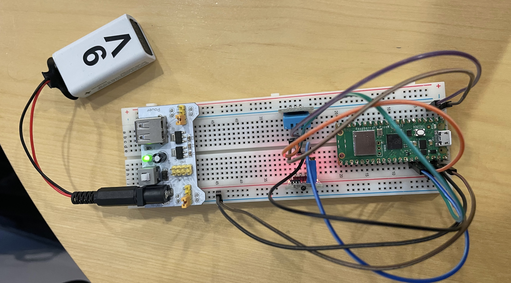

# Hardware 
## Raspberry pi
A raspberry pi is a small, low-power computer that is about the size of a credit card. It is made up of a single-board, which means all of the computer's components, including the processor, memory and input/output ports, are all contained on a single circuit board. It is commonly used in DIY projects, educations and industrial applications. It is a low cost and versatile computer that can be used for a wide range of applications.

## Breadboard
A breadboard is a type of prototyping board that is commonly used in electronics and computer science. It is called a "breadboard" because it is often used as a platform to build temporary circuits, much like how a baker might use a wooden board to shape dough. A breadboard is a rectangular board with a series of holed drilled into it. These holes are arranged in a grid, and are designed to accept the leads of electronic components such as resistors, capacitors and integrated circuits. By inserting these components into the breadboard and connecting them with jumper wires, it is possible to quickly build and test electronic circuits without the need for soldering. The allowance for easy experimentation makes the breadboard a popular choice for developing and testing new ideas.

### Breadboard power supply
A breadboard power supply is a device that provides electrical power to a breadboard. It typically provides a regulated DC voltage, such as 9V or 5V, and is used to power electronic components on the breadboard. Some breadboard power supplies also have built in power distribution, which means that they can distribute power to multiple breadboards at the same time.

## Sensors
### Temperature and humidity sensor - DHT11
The DHT11 is a commonly-used temperature and humidity sensor. It is a small, low-cost device that can be used to measure the ambient temperature and humidity in a room or enclosure. The DHT11 uses a capacitive humidity sensor and a thermistor to measure the ambient temperature and humidity. It is relatively accurate, but not as precise as some other temperature and humidity sensors on the market. It is often used in applications where a general idea of the temperature and humidity is sufficient, such as in home automation systems or weather stations. 

### Temperature sensor - KY-028
The analog KY-028 temperature sensor is a device that is used to measure temperature. It typically consists of a thermistor, which is a type of resistor that changes resistance based in changes in temperature, and an simplifier circuit that converts the change in resistance into a change in voltage or current. This change in voltage or current can then be measured and used to determine the temperature.

# Hardware connection
Using jumper wires the connection follows. We connect the raspberry pi pico w to the breadboard in on end and in the other end we connect to breadboard power supply. THe power supply is also connected to a 9 Volts battery. The power supply is connected to one of the sides of the breadboard. The plus side is connected to plus on the breadboard and the negative is connected to negative on the breadboard. The negative is then connected via a wire to a ground pin on the raspberry pi and the plus is connected to vbus on the raspberry pi. Now the raspberry pi has power and ground connection. 

We then start by connecting the DHT11 sensor, this has three pins. The first one is connected to gpio0/pin(1) on the pico, this is the pin thats sending out the data from the sensor. The second pin is connected to 3v3out on the pico which gives the sensor power. The third pin is then connected to a ground pin on the pico thus giving the sensor all it needs to send the information to the pico.

The KY-028 has four pins but to connect to the temperature sensor we only use its first three pins. The first pin is connected to ADC2/pin(34) this sends out the value from the sensor to the pico. The second pin is connected to a ground pin on pico and the third pin is connected to 3v3out. This gives the KY-028 sensor the power to send the values to the pico.

This means that the two sensors are connected and sending its data to the pico using the battery as a power supply. 

## Pictures of the full wiring

