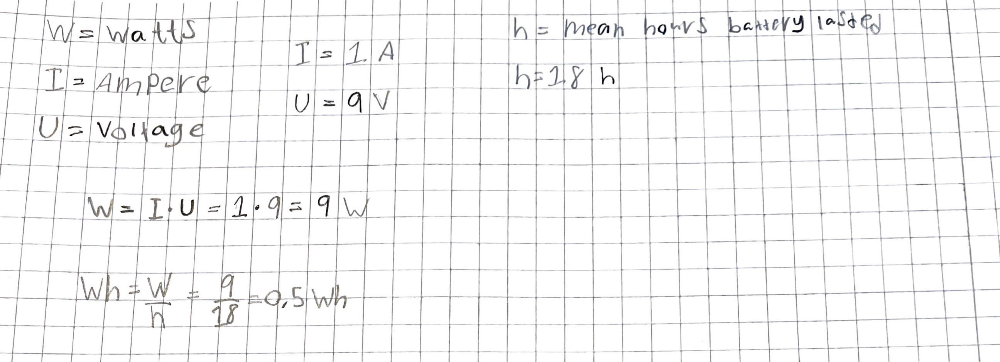

# *Testing Termostatuller*
## Requirements of the project
The municipality wants to be able to read temperature, decibel, humidity and co2 values in their locals in real time. Based on this, the projects requirements was set. To start the project we should calculate the temperature and humidity. Its data should be sent to a database every fifth minute and the data should be published on a webpage. The product should be stand-alone and using a wireless connection such as wifi. It should use an 9V battery and have a lifespan of at least a quarter before having to change battery. The values sent to the database should be saved for 7 days and a graph for all the values the last 7 days should be presented on the webpage. The last value read and a graph for the last day should also be presented on the webpage. The webpage shall be written in HTML5, css and javascript for the connection to the database. The code for the sensors and hardware is to be written in micropython. In later stages both a co2 sensor and a decibel reader should be able to be connected to the hardware without major work to be done.
These requirements could be broken down in to smaller parts.
- The sensors shows the correct value for temperature and humidity

- The municipality wants to be able to read the temperature and humidity in real time

- The values should be sent to the database every five minutes

- The website should show values for the last 7 days and 24 hours in a graph

- The project should be prepared for external sensors to be attached in later stages

- The battery should last for a quarter

# Exploratory testing
The municipality wants to see the real time value of temperature and humidity.

A successful testing would look like this:

We launch or website and our database - We start the application on the computer - We connect to the hardware to wifi using VSCode - we start running our program - our values are presented on the website with 5 minutes between and graphs for the last 24 hours and 7 days are presented.

The result:

When testing the full system it was a **success** as the real time values is presented on the website. The update frequency was 5 minutes and there are two graphs for each value, one for last 24 hours and one for last 7 days. The values can also seen being sent through the database.

# Manual testing
## Testing the **DHT11**
## Temperature:
###  ***Test 1 - The temperature is correct inside when comparing to calibrated thermostat***

**Prereq**:
- A program should be written to present the values gathered from sensor

**Input**:

- DHT11 should connect to the raspberry pi
- The program should be run in VSCode displaying values every fifth minute in the terminal.
- A calibrated sensor should be standing on the same spot as the DHT11 sensor
- Both sensors should have time to adapt to the surrounding temperature for about thirty minutes before starting the test.

**Behavior**:
- The result of this test should be that the values presented by the thermostat and the DHT11 sensor should be the same.

**Result**:

|Time | Thermostat |DHT11|
| ------ | ------|----- |
|10:40| 20,4 degrees | 20,6 degrees|
|10:45| 20,5 degrees | 20,9 degrees|
|10:50| 20,3 degrees | 20,8 degrees|

This result means that the difference from a calibrated thermostat only differs by 0,5 degrees. As it only differs by 0,5 degrees we can call it a **success** as the temperature can change in a split second due to for example a gust of wind on either the thermostat or the sensor. 

---
### ***Test 2 - The temperature changes when going outside in cold weather***

**Prereq**:
- A program should be written to present the values gathered from sensor

**Input**:
- DHT11 should connect to the raspberry pi
- The program should be run in VSCode displaying values every fifth minute in the terminal.
- Values should be collected from both inside and outside.

**Behavior**:
- The predicted behavior is that the temperature should drop because we know its colder outside than inside.

**Result**:

|Room |  |DHT11|
| ------ | ------|----- |
|Inside| | 22 degrees|
|Outside|  | 3 degrees|

This test can be seen as a **success** as the temperature clearly dropped when going outside. The exact value of the temperature outside is in this case irrelevant as we are only testing if the value goes the correct way when the temperature changes.

---

## Humidity:
### ***Test 1 - The humidity is correct***
**Prereq**:
- A program should be written to present the values gathered from sensor

**Input**:
- DHT11 should connect to the raspberry pi
- The program should be run in VSCode displaying values every fifth minute in the terminal.
- A calibrated humidity sensor should be present in the same room as the DHT11
- Both the SHT11 and calibrated sensor should be placed in the room for about 30 minutes before performing the testing.

**Behavior**:
- The result of this test should be that the values presented by the calibrated sensor and the DHT11 sensor should be the same.

**Result**:

|Time | Calibrated Sensor |DHT11|
| ------ | ------|----- |
|17:36 | 34 % | 36 %|
|17:41 | 34 % | 36 %|
|17:46 | 35 % | 34 %|

This result can be seen as a **success** because the difference is only 2 % which makes little to no difference in what we are measuring as the rough values are more important for us.

---

### ***Test 2 - The humidity changes when blowing air on the sensor***
**Prereq**:
- A program should be written to present the values gathered from sensor

**Input**:

- DHT11 should connect to the raspberry pi
- The program should be run in VSCode displaying values every five seconds.
- Values should be collected before and while blowing on the sensor

**Behavior**:
- When blowing on the sensor we should see it rising and then decrease again after some time.

**Result**:
This result was a **success** as the humidity provided by the sensor increased when blowing on the sensor. The results went up to as high as 90 % while beginning on 35 %. After around 10 minutes the sensor displayed around the same value as before testing

---

## Testing the **KY-028**
### ***Test 1 - The temperature is correct inside***
**Prereq**:
- A program should be written to present the values gathered from sensor

**Input**:
- KY-028 should connect to the raspberry pi
- The program should be run in VSCode displaying values every fifth minute.
- A calibrated thermostat should be standing on the same spot as the KY-028 sensor
- Both sensors should have time to adapt to the surrounding temperature for about thirty minutes before starting the test.

**Behavior**:
- The result of this test should be that the values presented by the thermostat and the KY-028 sensor should be the same.

**Result**:

|Time | Thermostat |KY-028|
| ------ | ------|----- |
|10:40| 20,4 degrees | 20,3 degrees|
|10:45| 20,5 degrees | 20,5 degrees|
|10:50| 20,3 degrees | 20,7 degrees|

This test for us was a **success**. There is a maximum difference in 4 degrees while testing which in our case does not make the biggest difference. As always when testing temperature it can differ by small things like a gust of wind. To create a fully accurate testing scene you would have to have a room separated from any external influence.

---

### ***Test 2 - The temperature changes when going outside***
**Prereq**:
- A program should be written to present the values gathered from sensor

**Input**:
- KY-028 should connect to the raspberry pi
- The program should be run in VSCode displaying values every fifth minute in the terminal.
- Values should be collected from both inside and outside.

**Behavior**:
- The predicted behavior is that the temperature should drop because we know its colder outside than inside.

**Result**:
|Room |  |KY-028|
| ------ | ------|----- |
|Inside| | 22 degrees|
|Outside|  | 3 degrees|

This test can be seen as a **success** as the temperature clearly dropped when going outside. The exact values collected from this test is irrelevant as the important thing was that the temperature changed when the going outside in the cold weather as it did.

---

## Testing the battery life
### Requirement being tested:
### - The battery should last for a quarter of a year

### ***Test 1 - Due to suspicion of the battery life not being long at all we start by testing if the battery holds for 24 hours.***

**Prereq**:

- Product should be fully finished with all attributes to get the correct battery usage.

**Input**:

- Connect new battery to breadboard power supply
- Connect hardware to computer
- Open VSCode
- Start the micropython program on raspberry pi
- Disconnect pico from computer

**Behavior**:

- The product should still be sending data to the website after 24 hours

**Result**:
- After doing this test and repeating it three times we can see that the result is that after about 18 hours the battery dies. The conclusion we can draw from this is that we have to change something in our code because it is not even close to our requirement. Another solution would be to connect the product to a powerbank or directly to the wall. So this test was a **failure**.
---

### ***Test 2 - Estimating power usage***

**Prereq**:
- Product should be fully finished with all attributes to get the correct battery usage.
- Testing of the full battery life should be made

**Input**:
- Found a mean of the 9 volt battery to 1 ampere
- Found out how to calculate the watt via ampere and voltage
- Using watt result we can compute the projected power usage

**Behavior**:
- Its hard to say what our perfect result is but the lesser the power usage the better in our case

**Result**:

