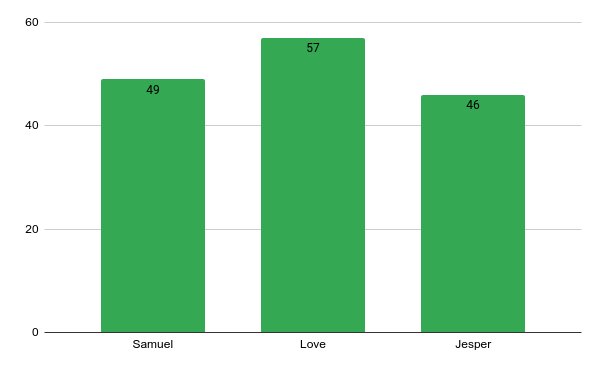

# Timelog Termostatuller
### 2022-12-05, Jesper, Love and Samuel, 1 hour.
- Started planning the project a little bit more detailed
---

### 2022-12-07, Samuel, 2 hours.
- hardware programming and setup

--- 
### 2022-12-05, Samuel, 1 hour.
- more hardware programming 

--- 
### 2022-12-05, Love, 2 hours.
- fixed sql server

---

 ### 2022-12-08, Jesper, Love and Samuel, 5 hours.
 - Getting the project started with hardware connections and gitlab file management. Working with the database server that was setup. Started planning the look of the website and which functions it should include.
 
 

---
 ### 2022-12-08, Love, 2 hours.
 - DummySQL server
---
### 2022-12-09, Love and Samuel, 1 hour.

- Worked on connecting the pico to our dummy_sql server to be able to push data given by the sensors to our database.
---
 ### 2022-12-09, Samuel, 2 hours.
 - website base
---
### 2022-12-11, Jesper and Samuel, 3 hours.

- Worked on getting the second sensor to work properly.
- Worked on getting the website to present charts not there yet.
- Worked on hardware and time schedule.
---

 ### 2022-12-11, Love, 1 hour.
 - webbserver(nignx)
---
### 2022-12-12, Jesper, Love and Samuel, 4 hours.

- Started getting the framwork for testing the product and writing the hardware descriptions
- Worked on the connection between the website and the server
---
### 2022-12-12, Samuel, 1 hour.
- Continued on the connection
---
### 2022-12-12, Love, 2 hours.
- Continued on the connection
---
### 2022-12-13, Love, 2 hours.
- Tried writing website in html
---
### 2022-12-13, Jesper, 1 hour.
- describing hardware
---
### 2022-12-14, Jesper, Samuel, 3 hours.
- Finished the wiring and description of hardware and took pictures
- Product is now ready to be setup to start collecting values on the dataserver
- Continued working on the connection between the dataserver and the website
- Added more functions to website
---
### 2022-12-14, Jesper, Samuel and Love, 2 hours.
- Still working on the connection between the database and webpage.

---

### 2022-12-15, Jesper, Samuel and Love, 7 hours.
- Finalizing product and preparing for presentation
- Successfully got everything set up with website connection
- Testing
---
### 2022-12-15, Love, 2 hours.
- cleaning up the code
---
### 2022-12-16, Love, 5 hours.
- log in system
---
### 2022-12-17, Love, 4 hours.
- log in screen
---
### 2022-12-18, Love, 2 hours.
- log in screen
---
### 2022-12-19, Jesper 1 hour.
- presentation
---
### 2022-12-19, Love, 2 hours.
- presentation
---
### 2022-12-20, Jesper, Samuel and Love, 2 hours.
- Last preparations before presentation
- Presentation
---
### 2022-12-21, Love, 2 hours.
- c++ on hardware
---
### 2022-12-22, Love, 2 hours.
- c++ compiler
---
### 2022-12-22, Samuel, 4 hours.
- c++ compiler
---
### 2022-12-23, Jesper, 1 hour.
- cleaning up the code
---
### 2022-12-23, Love, 2 hours.
- log in screen debug
---
### 2022-12-23, Samuel, 4 hours.
- c++ compiler
---
### 2022-12-25, Samuel, 4 hours.
- c++ compiling problems
---
### 2022-12-26, Jesper, 2 hours.
- Writing in our test results
---
### 2022-12-27, Jesper, 3 hours.
- Continued on writing in test results
---
### 2022-12-28, Jesper, 1 hour.
- spellchecking and cleaning up
---
### 2022-12-30, Jesper, 4 hours.
- Writing readme and reorganizing
---
### 2023-01-07, Jesper, 2 hours.
- requirements and user-story
---
### 2023-01-10, Jesper, Love and Samuel, 3 hours.
- Finishing touches 
---
### 2023-01-10, Jesper, 1 hour.
- Results in readme and spellchecking

### 2023-01-14, Love, 2 hour.
- Create manuscript for video and film it

---

